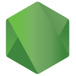

##  Hi there! My name is Luciano Aguiar.

I am a gaming and tech enthusiast who has discovered my calling in coding. I'm excited to share my skills and experience with you.

I have recently undergone an intensive 1200-hour coding program at [Driven Education](https://www.driven.com.br/), which has provided me with expertise in multiple web technologies, software engineering fundamentals,  databases, behavioral skills, and agile methodologies (SCRUM).

My goal is to improve my coding skills so that I may effect positive change in the world and help those in need.

I thrive working in a team environment, am always up for a challenge, and am eager to work on exciting projects. Let's collaborate and create something phenomenal!

 
 
## More about me

- 🔭 I'm currently looking for work
- 🌱 I'm learning Docker and AWS
- 👨🏻‍💻 You can see all my projects [here](https://github.com/Luciano-Rangel-Aguiar?tab=repositories)
- 🧠 I'm currently developing a web app to help me manage my ADHD.
- 💬 Feel free to contact me to offer feedback on any of my projects or ask me anything
- 📫 You can always message me here or on my [LinkedIn](https://www.linkedin.com/in/luciano-aguiar-developer/)
- ⚡ Fun fact: I love TTRPGs (mostly D&D 5e and Pathfinder 2e), videogames, and anything fantasy-related

 
  
## Languages and tools I have used:

